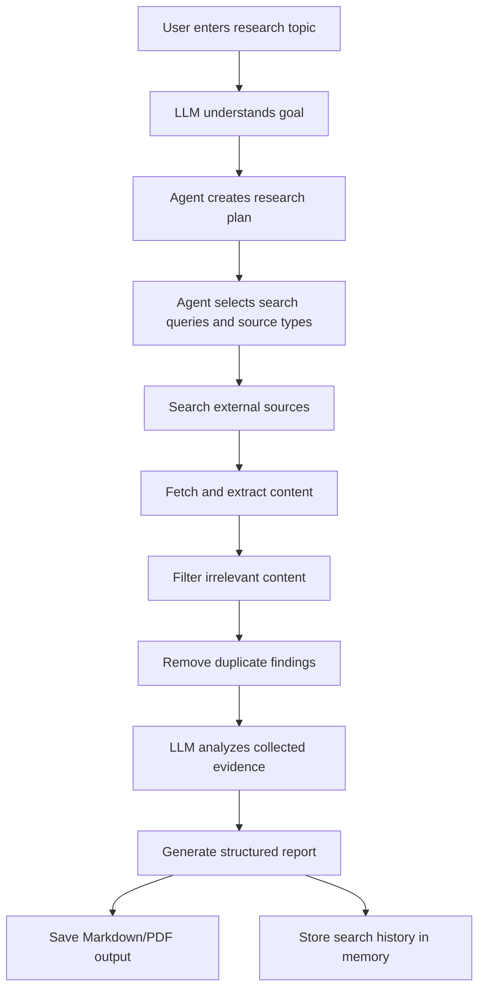

# Autonomous Research Agent

Assessment Option 1: build an autonomous AI agent that collects information from external sources, analyzes it, and generates a structured, actionable summary.

## Author

**Suman Behera**

- Portfolio / GitHub: https://github.com/sumanbehera-ds
- LinkedIn: set `AUTHOR_LINKEDIN` in `.env` with your exact LinkedIn profile URL before final submission.

## What This Agent Does

The agent accepts a user research topic and autonomously:

1. Understands the user's goal with an LLM.
2. Creates a research plan and search queries.
3. Searches external sources.
4. Fetches and extracts source content.
5. Filters irrelevant information and removes repeated findings.
6. Generates a structured report with key points, important findings, sources, and actionable insights.
7. Exports the result as Markdown and optionally PDF.
8. Stores previous searches in local SQLite memory.

## Workflow



## Tech Stack

- Python 3.10+
- OpenAI-compatible LLM API
- DuckDuckGo HTML search fallback
- Optional Tavily search API
- HTTPX for web fetching
- Trafilatura and BeautifulSoup for text extraction
- SQLite for memory
- ReportLab for optional PDF export

## Installation

```bash
python -m venv .venv
.venv\Scripts\activate
pip install -r requirements.txt
pip install -e .
```

On macOS/Linux, activate the environment with:

```bash
source .venv/bin/activate
```

## Configuration

### Option A: No OpenAI Key, Use Local Ollama

Copy the example environment file:

```bash
copy .env.example .env
```

On macOS/Linux:

```bash
cp .env.example .env
```

The default `.env.example` is configured for Ollama:

```env
LLM_PROVIDER=ollama
OLLAMA_MODEL=llama3.1
OLLAMA_BASE_URL=http://localhost:11434
```

Optional author/profile details can be shown in generated reports:

```env
AUTHOR_NAME=Suman Behera
AUTHOR_PORTFOLIO=https://github.com/sumanbehera-ds
AUTHOR_LINKEDIN=https://www.linkedin.com/in/your-linkedin-profile
```

Install Ollama from `https://ollama.com`, then pull a local model:

```bash
ollama pull llama3.1
```

Keep Ollama running while using the agent.

### Option B: Use OpenAI

```env
LLM_PROVIDER=openai
OPENAI_API_KEY=your_openai_api_key_here
OPENAI_MODEL=gpt-4o-mini
```

Optional:

```env
TAVILY_API_KEY=your_tavily_api_key_here
```

If `TAVILY_API_KEY` is missing, the agent uses DuckDuckGo HTML search.

## Usage

Run a research task:

```bash
research-agent run "Latest trends in agentic AI for cybersecurity"
```

Short form:

```bash
research-agent "Latest trends in agentic AI for cybersecurity"
```

Generate Markdown and PDF:

```bash
research-agent run "AI automation in security operations" --pdf
```

Limit sources:

```bash
research-agent run "Open source LLM observability tools" --max-sources 5
```

View past runs:

```bash
research-agent history
```

View one saved run:

```bash
research-agent show 1
```

## Output

Reports are saved in the `reports/` folder as Markdown. If `--pdf` is used, a PDF is saved beside the Markdown file.

Local memory is stored in:

```text
.agent_memory/research_history.sqlite3
```

## Project Structure

```text
src/research_agent/
  cli.py          Command line interface
  pipeline.py     End-to-end autonomous workflow
  llm.py          OpenAI-compatible LLM client
  prompts.py      Planning, extraction, and synthesis prompts
  search.py       Tavily and DuckDuckGo search providers
  fetch.py        Web page fetching and text extraction
  memory.py       SQLite search history
  exporters.py    Markdown and PDF export
  models.py       Shared data models
  utils.py        Utility helpers
tests/
  test_memory.py
  test_pipeline.py
  test_utils.py
```

## Notes For Reviewers

- The response is not hardcoded. The LLM plans the search, analyzes collected source evidence, and writes the final report.
- The agent performs real external source lookup and page extraction.
- The code is original and organized as a small, reviewable Python package.
- The pipeline can run with any OpenAI-compatible API by setting `OPENAI_BASE_URL`.

## Run Tests

```bash
pytest
```
